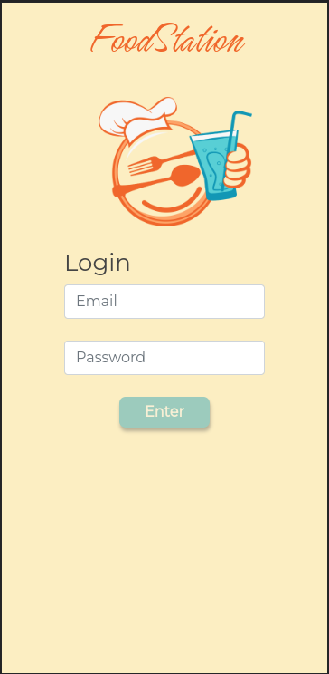
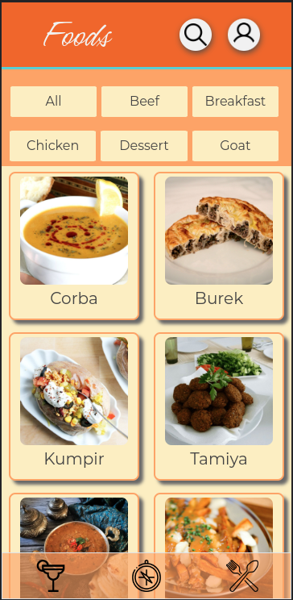

# Recipes App

This project was developed during the web development course at [Trybe](https://www.betrybe.com/). It was developed by a team formed by
[Denilson Santuchi](https://github.com/Denilson-Santuchi),
[Gabriel Bins](https://github.com/gabrielbins),
[Marina Fischer](https://github.com/marinafischer),
[Aline Siqueira](https://github.com/alinemsiqueira), and myself.
This project is a Front End application design to host a variety of food and drinks recipes where the user can explore and discover new foods and drinks <br>
or search for something more especific.

The main goal here was to put in practice all we had learned of React development. We used react hooks for pratice, since we used Redux on other two passed projects.
<br>
<br>
<strong>This App was developed using a mobile first mothodology</strong>
<br>



## Used APIs

[The Meal DB](https://www.themealdb.com/)

[The Cocktail DB](https://www.thecocktaildb.com/)

## Installation

Clone this repository
```bash
git clone git@github.com:VitorCorrea18/project-recipes-app.git
```
In the project's folder install the dependencies
```bash
npm install
```
Start the project
```bash
npm start
```

Now it should be running on your default browser

## Usage

<strong>Login</strong> <br>
>You must enter an email with a valid format like email@example.com, and a password with 6 or more characters then click on the login button.

* <strong>Food Page</strong> <br>
>The first page will be the <strong>Food page</strong>, here there will be some recipes (we limited at 10 recipes to make it easier and simpler). <br>
>- The header includes two icons witch you can click to navigate to the profile or open the search section
>- Bellow the header you will see category buttons to filter the recipes by category
>- On the bottom of the screen there is a navigation menu, witch you can go to Drinks page, or the Explore page
>- Clicking on a recipe card will take to the recipe page with the details

<strong>Drink Page</strong> <br>
>Basicly the same as <strong>Food page</strong>

<strong>Search Bar</strong>
>By clicking the search icon in the header will open the search section where you can search by ingredient, name or fisrt letter. <br>
You need to type something and select one of the options before clicking on search.

<strong>Profile</strong>
>By clicking the profile icon in the header you will be redirect to the <strong>Profile page </strong>. Here you can see you 'Done recipes',
'Favorite Recipes' or logout.

<strong>Explore</strong>
>In the <strong>Explore page</strong> you can explore Foods and Drinks by Nationality, Ingredient or find out new recipes clicking on 'Surprise Me!'

<strong>Recipe Page</strong>
>Here you can see the recipe details like 'Ingredients', 'Instructions' and a tutorial video. The heart and share icons will save to favorites and
copy the current link respectively, and down bellow at the end of the page you can see more sugestions for you. The 'Start recipe' button will give you
the ingredients in checkbox format to keep track of yout list and after you finish your recipe you can click on 'Finish' button. The recipe can be found
on 'Done Recipes' on the <strong>Profile page</strong>.

 <strong>Feel free to send me feedbacks :rocket:</strong>
